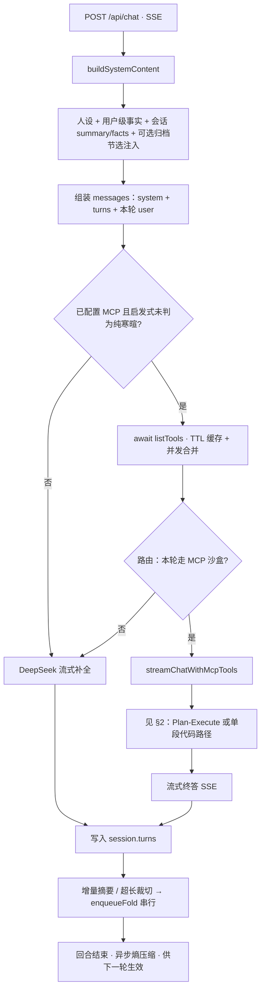
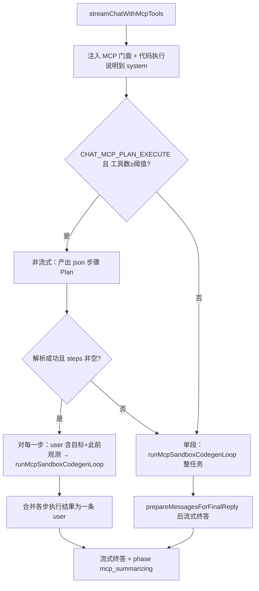
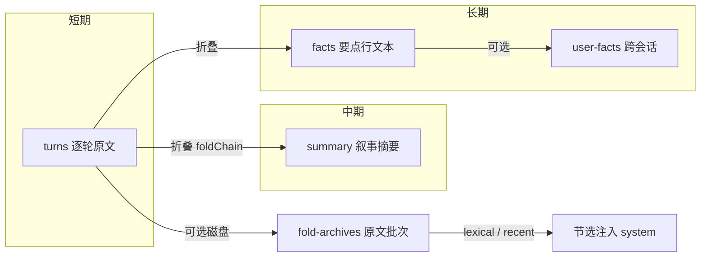

# 知忆（chatbot-memory）架构说明

本文档为 **chatbot-memory** 的唯一架构文档：主流程与核心实现细节。运行方式、API、环境变量表见应用根目录 [`README.md`](../README.md)。

---

## 1. 单轮对话主流程（含可选 MCP）

**路由说明（进入 `streamChatWithMcpTools` 之前）**

- **`inferMcpRouteByHeuristic`**：关键词/短句可判定「明显要工具」→ 直接走 MCP；「明显寒暄」→ 跳过 `listTools` 与 MCP，直连流式。
- 不明确时，若开启 **`CHAT_MCP_TURN_ROUTER`**：非流式 **`shouldUseMcpSandboxForTurn`**（路由 LLM，YES/NO）决定是否走沙盒；关闭则只要 `listTools` 非空即走 MCP（旧行为）。
- **`listTools` 失败**或 MCP 路径抛错：打日志并**回退**为无工具流式。

会话 **`turns`** 只存 user/assistant 文本；MCP 路径里「生成代码 / 执行结果」等多轮中间消息**不落盘**到历史，仅用于当轮构造上下文。

---

## 2. MCP 工具执行：Plan-Execute 与单段路径

本应用**不使用** DeepSeek 的 `tools` / `tool_calls`。做法是：在 **system** 中注入 **`mcp` 门面**（由 `listTools` 的 schema 生成 TypeScript 式说明），让模型输出 **fenced 代码**；代码在**子进程** **`node:vm`** 中执行，通过 **IPC** 由父进程将 `__call_mcp__` / `mcp[...]` 映射为 **`McpPool.callTool`**。子进程环境会**剔除** `DEEPSEEK_*`、`MCP_SERVERS`、常见 `*_API_KEY` 等敏感变量。

进入 **`streamChatWithMcpTools`**（`chat-mcp-tools.ts`）后的分支逻辑如下。

### 2.1 何时走 Plan-Execute（多步规划再执行）

同时满足时，先走 **Plan**，再走 **Execute**：

| 条件 | 默认 / 说明 |
|------|----------------|
| `CHAT_MCP_PLAN_EXECUTE=true` | 默认开启；`false` 则**始终**走单段代码路径 |
| `listTools` 合并后的工具条数 ≥ `CHAT_MCP_PLAN_MIN_TOOLS` | 默认 **2**；仅 1 个工具时常跳过规划，省一次非流式调用 |
| 能解析出非空 `steps` | 单独一次非流式「规划」补全，模型只应输出**一个** JSON fenced 块，形如 `{ "steps": [ { "id", "goal", "notes?" }, … ] }` |

**规划阶段（`fetchMcpExecutionPlan` + `mcp-plan-execute.ts`）**

- System：规划提示；User：当前用户问题 + 工具摘要 + **近期对话摘录**（消解「那个文件」等指代）。
- 温度取 `min(主对话 temperature, 0.35)`，`max_tokens` 约 2048。
- **`parseMcpPlanFromModelText` 失败**或 `steps` 为空：**整路回退**为下面的**单段代码路径**（不打断用户，只是少一次「先规划」）。

**执行阶段（对 `plan.steps` 顺序 for 循环）**

- 每一步向对话副本追加一条 **user**，内容包含：步骤标签、本步 **goal**、可选 **notes**、以及 **`【此前步骤观测】`**（前面各步沙盒输出的 `【代码执行结果】` 摘要拼接）。
- 每一步内部调用同一个 **`runMcpSandboxCodegenLoop`**（与单段路径共用）：**非流式**要代码 → **沙盒执行** → 成功则得到本步 `execText`，失败则在**本步**内重试生成代码，直到 **`CHAT_MCP_PLAN_STEP_CODE_ROUNDS`**（默认 **6**）轮用尽则**整轮抛错**（外层 `chatbot` 可回退普通流式）。
- 步数上限 **`CHAT_MCP_PLAN_MAX_STEPS`**（默认 **8**），超出截断并打日志。
- SSE 在此阶段会 **`yield { phase: "mcp_planning" }`**（规划前）、每步循环中 **`mcp_codegen` / `mcp_tools`** 等（见 `runMcpSandboxCodegenLoop`）。

**合并终答**

- 多步全部成功后，**不**把中间多轮「代码/执行细节」按条写入 `turns`；而是用**干净**的 `options.messages` 副本 + 一条占位 assistant + 一条 user，user 中为**合并后的** `【代码执行结果】`（各步块拼接）+ **终答后缀**（要求用自然语言、不复述代码）。
- 然后进入 **流式** `chat/completions`，并 **`yield { phase: "mcp_summarizing" }`**，把增量正文推给前端。

### 2.2 单段代码路径（与 Plan 互斥或作为回退）

在以下情况走 **单段**（整轮任务一次「代码生成 ↔ 沙盒」循环，直到成功或耗尽轮次）：

- 未开启 Plan-Execute，或工具数 &lt; `planMinTools`；
- 规划失败或 `steps` 为空；
- 用户显式关闭 `CHAT_MCP_PLAN_EXECUTE`。

- 在**同一条** user 任务下，反复：**非流式**生成含 **一个** `javascript`/`typescript` 代码块 → **`runMcpSandboxCode`**（子进程池、超时 `CHAT_MCP_CODE_MAX_MS`、单轮调用次数 `CHAT_MCP_CODE_MAX_CALLS`）→ 失败则把 `【代码执行结果】` + 重试说明追加进 `messages` 再请求，直到成功或超过 **`MAX_MCP_CODE_ROUNDS`（源码常量 16）**。
- 成功后 **`prepareMessagesForFinalReply`**：把最后一条含代码的 assistant 换成占位说明，避免终答**复述代码**；再 **流式**终答，并 `mcp_summarizing`。

### 2.3 沙盒与进程

- **默认**：`fork` 子进程跑 `mcp-sandbox-child.ts`，池大小 **`CHAT_MCP_SANDBOX_POOL_SIZE`**（默认 **4**），成功执行后归还池；`0` 表示每次新建子进程。
- **`CHAT_MCP_SANDBOX_IN_PROCESS=true`**：同进程 vm，仅建议本机调试（逃逸影响整个服务进程）。

### 2.4 MCP 路径示意图（Plan 与单段）

---

## 3. 记忆分层与折叠

- **增量摘要**：总轮数为 N 的整数倍时，从队首移出 N 对轮次，异步经 LLM 并入 `summary`/`facts`（`enqueueFold`，`incremental`）。
- **超长裁切**：超过 `maxHistoryPairs` 时从队首成对丢弃；若开启 `summarizeOnTrim` 则同样进入折叠（`trim`）。
- **折叠链**：`session.foldChain` 串行，避免并发写坏 `summary`/`facts`。
- **失败恢复**：折叠 LLM 有限重试；仍失败则回灌 `turns`（`foldReinjectPrefixLen` 保证 incremental 与 trim 顺序正确），并已写入归档时 **`rollbackAppend`** 撤销孤儿条目。

---

## 4. 其他有价值实现（简表）

| 能力 | 要点 |
|------|------|
| **折叠原文归档** | 折叠前落盘；成功后 `finalizeEntry` 与 `foldArchiveLinks` 对齐；可选按用户输入做 lexical 相关度或取最近批次注入 system。 |
| **熵过滤** | 回合结束后异步改写已落盘 `turns`，不阻塞本轮流式。 |
| **持久化** | 默认分文件会话目录 + manifest；变更会话写盘。 |
| **SSE `phase`** | 如 `mcp_planning`、`mcp_codegen`、`mcp_tools`、`mcp_summarizing`；前端可用 `phaseLabel()`。 |

---

## 5. 关键源码入口

| 模块 | 路径 |
|------|------|
| 对话主链路、路由、折叠、熵 | `src/server/chat/chatbot.ts` |
| system、归档节选 | `src/server/chat/system-content.ts`、`fold-archive-inject.ts` |
| 折叠队列与回灌 | `src/server/chat/memory-fold.ts`、`memory-turns.ts` |
| MCP 流式、Plan/单段、沙盒循环 | `src/server/mcp/chat-mcp-tools.ts` |
| 规划提示与 json 解析 | `src/server/mcp/mcp-plan-execute.ts` |
| fork 池、vm、IPC | `src/server/mcp/mcp-code-sandbox.ts`、`mcp-sandbox-child.ts` |
| MCP 连接池、`listTools` 缓存 | `src/server/mcp/mcp.ts` |
| 门面生成 | `src/server/mcp/mcp-facade-prompt.ts` |
| 限额 env | `src/server/mcp/chat-mcp-limits.ts` |
| 持久化 | `src/server/persistence/session-store.ts`、`fold-archive-store.ts`、`user-facts-store.ts` |
| SSE 片段 | `src/shared/chat-stream.ts` |

环境变量默认值与说明见仓库根目录 `.env.example` 与应用 [`README.md`](../README.md)。
