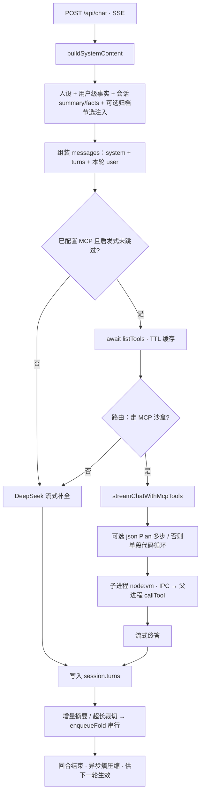
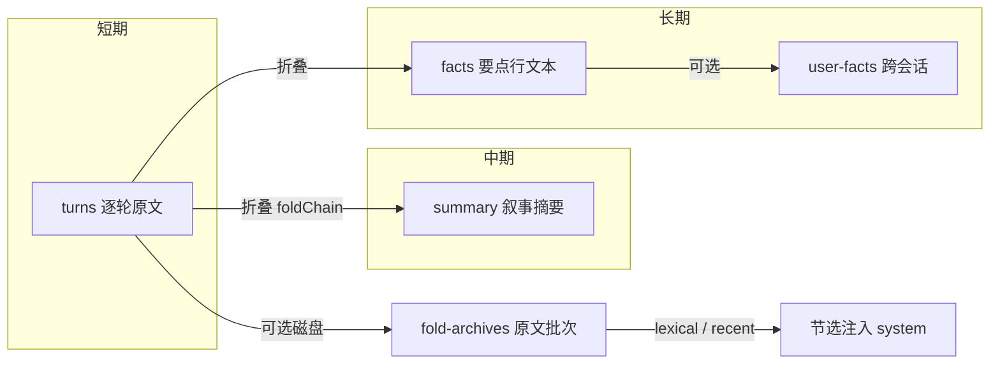

# 知忆（chatbot-memory）架构说明

本文档为 **chatbot-memory** 的唯一架构文档：主流程与有价值的功能实现。运行方式、API、环境变量表见应用根目录 [`README.md`](../README.md)。

---

## 主流程图

### 单轮对话（含可选 MCP）

### 记忆分层（概念）

---

## 有价值的功能实现

| 能力 | 实现要点 |
|------|----------|
| **分层记忆** | `turns` verbatim；超出策略时移出批次经 LLM 并入 `summary` / `facts`；`foldChain` 串行避免并发写坏会话层。 |
| **折叠失败可恢复** | 折叠 LLM 有限重试；仍失败则按序回灌 `turns`（`foldReinjectPrefixLen` 协调 incremental 与 trim）、失败时撤销归档 `append`（`rollbackAppend`）。 |
| **折叠原文归档** | 折叠前落盘批次；成功后 `finalizeEntry` 与会话 `foldArchiveLinks` 对齐；可选按用户输入 lexical 相关度或最近批次向 system 注入节选，控制 token。 |
| **熵过滤** | 回合结束后异步改写已落盘 `turns`，不阻塞本轮流式首包。 |
| **MCP 不接原生 tools** | System 注入 `mcp` 门面；模型输出 fenced 代码 → 子进程 `node:vm` + IPC → 父进程 `callTool`；敏感环境变量在子进程侧剥离。 |
| **MCP 工程化** | `listTools` TTL 与并发合并；启发式 + 可选路由 LLM 决定是否走沙盒；工具多时可 **Plan-Execute**（json 步骤 → 按步代码/沙盒）；沙盒 **子进程池**复用；SSE **`phase`** 粗粒度阶段。 |
| **持久化** | 默认分文件会话目录 + manifest；变更会话增量写盘。 |

---

## 关键源码入口（便于下钻）

| 模块 | 路径 |
|------|------|
| 对话主链路、折叠入队、熵异步 | `src/server/chat/chatbot.ts` |
| system 拼装、归档节选 | `src/server/chat/system-content.ts`、`fold-archive-inject.ts` |
| 折叠队列与重试回灌 | `src/server/chat/memory-fold.ts`、`memory-turns.ts` |
| MCP 流式与 Plan / 沙盒 | `src/server/mcp/chat-mcp-tools.ts`、`mcp-plan-execute.ts`、`mcp-code-sandbox.ts` |
| MCP 连接池 | `src/server/mcp/mcp.ts` |
| 会话 / 归档 / 用户事实 | `src/server/persistence/session-store.ts`、`fold-archive-store.ts`、`user-facts-store.ts` |
| SSE 片段与 phase | `src/shared/chat-stream.ts` |
